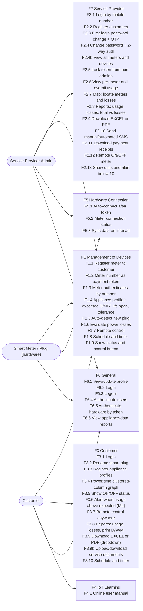
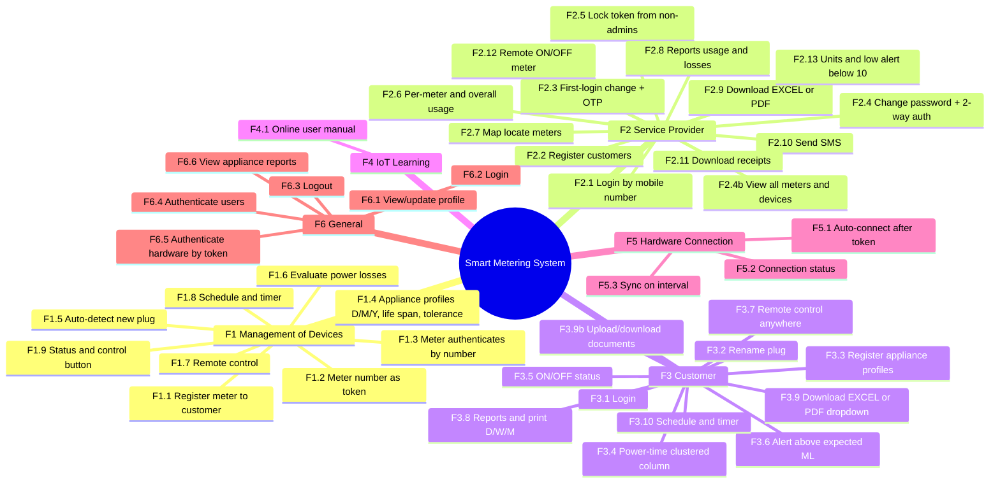
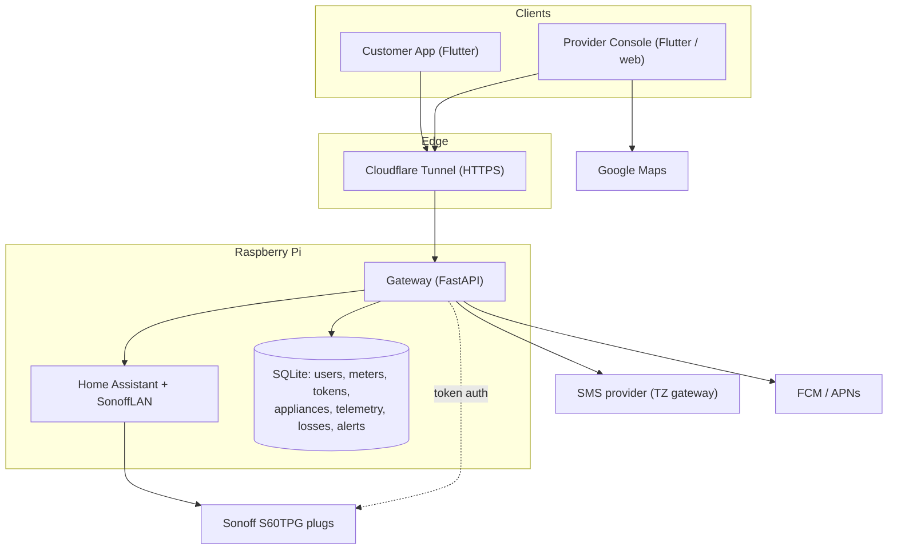
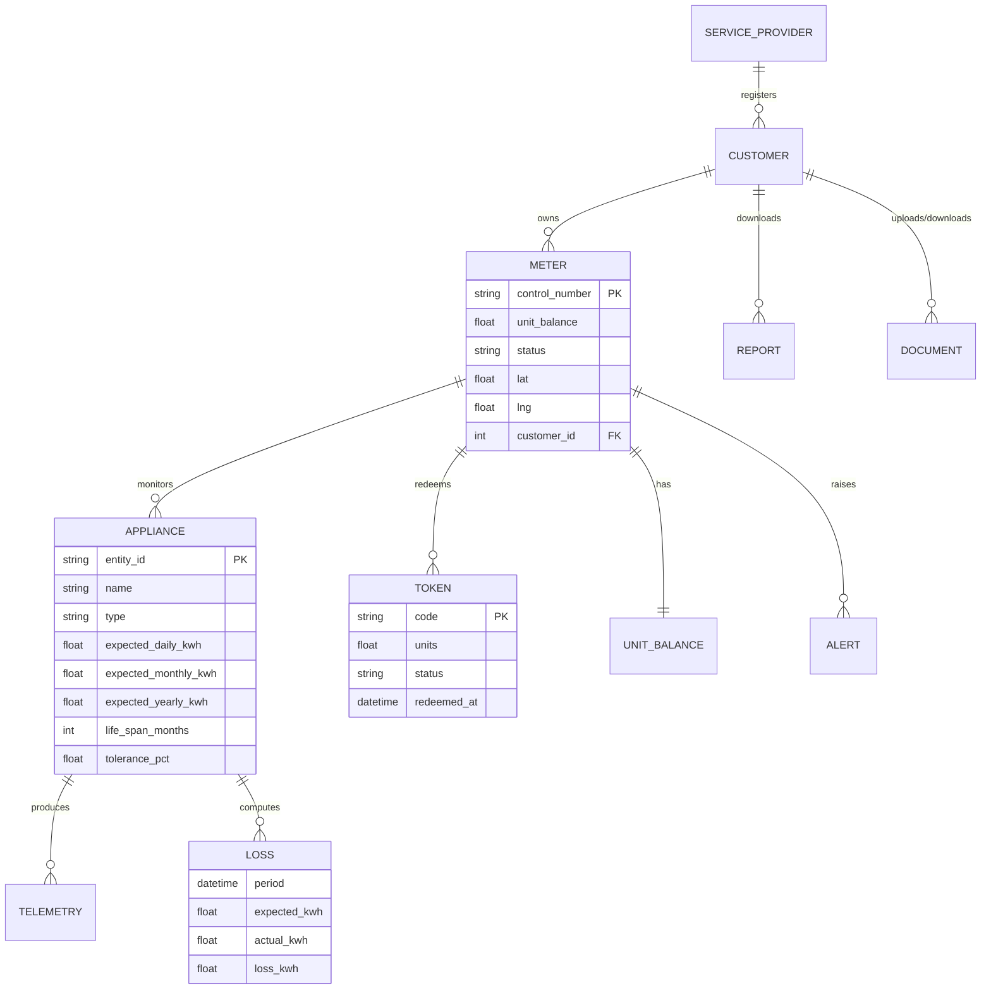
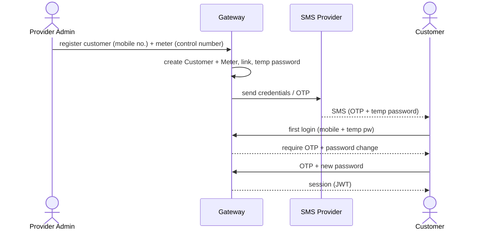
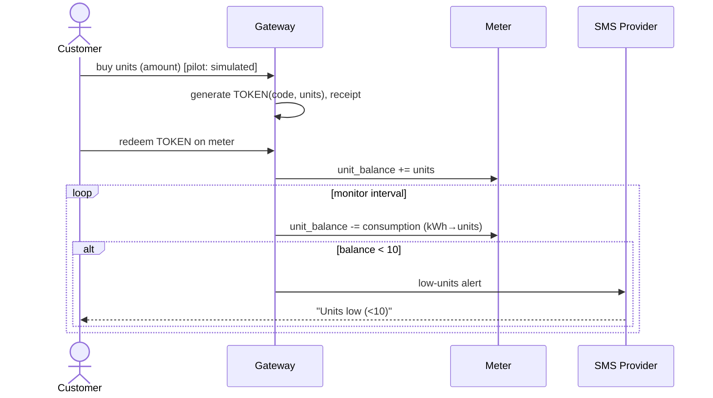
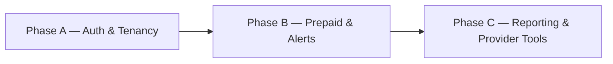

# System Requirements Alignment (F1–F6)

## Status

proposed

## Context

- A stakeholder "System Requirements" document (functional requirements F1–F6) describes a **prepaid
  smart-metering platform** with two roles — **Service Provider** (utility) and **Customer** — built
  around a **smart meter + token/control number + prepaid units** (LUKU/STS-style), appliance power
  profiles, loss computation, SMS, maps, and Excel/PDF reporting.
- The current system is a **single-site smart-plug monitoring & control app**: Flutter app + FastAPI
  gateway (JWT auth) → Home Assistant + SonoffLAN + Sonoff S60TPG plugs, on a Pi behind a Cloudflare
  Tunnel. It already covers control, telemetry, scheduling, diagnosis (ML), usage-by-period, alerts
  (push/in-app), and PDF reports.
- This document records the gap and a phased path so it can be reviewed before folding into
  `docs/design` and `docs/implementation`.

## Problem

The spec introduces behavior absent from current design: a metering/token/prepaid domain, a
service-provider tenant, mobile+OTP auth, appliance consumption profiles, loss analytics, SMS, maps,
and Excel export. These are net-new and must be resolved here before execution.

## Proposed Change

Extend the current plug-control system into the spec's prepaid smart-metering platform, in three
phases, without rebuilding what already works:

- Add a **provider/customer** tenancy and a **`Meter`** domain (control number, units, status, geo),
  with **mobile-number + OTP** auth and **token-gated** hardware connection.
- Add a **prepaid units ledger** (token redemption + consumption decrement), **appliance consumption
  profiles** (expected D/M/Y, life span, tolerance), a **loss** metric (actual − expected), and an
  **SMS** channel (manual/automated; low-units < 10).
- Add **provider tooling** (all-meters dashboard + **Google Maps**), **losses reporting**, **Excel +
  PDF** export with a format selector, **document upload/download**, and an **online user manual**.

Reuse: existing auth/JWT, plug control, telemetry logging, scheduling, diagnosis ML, usage-by-period,
PDF generators, alerts/push. Full requirement→phase mapping in the table and "Phased Plan" below.

## Open Decision (blocking Phase B scope)

- **Prepaid token engine: real vs simulated.** Default assumption for the pilot: a **simulated** units
  ledger in the gateway (token generated/redeemed internally), with a clean adapter seam to swap in a
  real STS/vendor token API later. Confirm before Phase B.

---

## Gap Traceability (requirement → status → update)

Legend: ✅ done · 🟡 partial · ❌ missing

| Req | Requirement (abridged) | Status | Update needed |
|-----|------------------------|--------|---------------|
| F1.1 | Provider admin registers smart meter to customer account | ❌ | Provider role + `Meter` entity + customer↔meter linkage |
| F1.2 | Meter number (control number) as payment token | ❌ | Control-number / token model |
| F1.3 | Meter authenticates via meter number | ❌ | Token-based hardware auth |
| F1.4 | Register appliances: expected consumption (D/M/Y), life span, tolerance | ❌ | Extend appliance model + UI |
| F1.5 | Auto-detect new smart plug | 🟡 | SonoffLAN plug-and-play exists; add explicit "new device" surfacing |
| F1.6 | Evaluate data to show power **losses** | 🟡 | Diagnosis exists; add formal loss = expected − actual |
| F1.7 | Remote automation/control | ✅ | — |
| F1.8 | Scheduling + timer control | ✅ | — |
| F1.9 | Show ON/OFF status + control button on issues | ✅ | — |
| F2.1 | Provider login via **mobile number** + password | 🟡 | Email today → add mobile-number identity |
| F2.2 | Provider registers customers | 🟡 | Admin approve today → provider-driven registration |
| F2.3 | Force password change on first login + **OTP** | ❌ | OTP + forced reset |
| F2.4 | Change password anytime + 2-way auth | ❌ | Change-password + 2FA |
| F2.4b | Provider views all meters + connected devices | 🟡 | Admin sees one site → all-meters view |
| F2.5 | Lock token/control number from non-admins | ❌ | Field-level permission on token |
| F2.6 | Provider views per-meter + overall usage | 🟡 | Usage exists; scope to meters |
| F2.7 | **Google Maps** geolocation per meter | ❌ | Lat/long + provider map |
| F2.8 | Provider reports: usage, **losses**, total vs losses; print D/W/M | 🟡 | Have usage+PDF; add losses + print scopes |
| F2.9 | Download reports as **EXCEL or PDF** | 🟡 | PDF only → add Excel |
| F2.10 | Send manual/automated **SMS** | ❌ | SMS provider integration |
| F2.11 | Download payment receipts | ✅ | Receipt PDF generator exists |
| F2.12 | Provider remote ON/OFF of the meter | 🟡 | Plug control exists; scope to meter |
| F2.13 | Show available **units**, alert when < 10 | ❌ | Units balance + low-balance alert |
| F3.1 | Customer login (username+password) | ✅ | — |
| F3.2 | Rename smart plug to appliance | ✅ | — |
| F3.3 | Register appliance profiles (as F1.4) | ❌ | Same as F1.4 |
| F3.4 | Energy/power graph (clustered column) | 🟡 | Bar/sparkline exist; align to clustered column |
| F3.5 | Show ON/OFF status | ✅ | — |
| F3.6 | Alert when usage higher than expected (**ML**) | 🟡 | Diagnosis vs own baseline → vs user-entered expected |
| F3.7 | Remote control from anywhere | ✅ | — |
| F3.8 | Customer reports: usage, losses; print D/W/M | 🟡 | Add losses |
| F3.9 | Download EXCEL or PDF via dropdown | 🟡 | Add Excel + format dropdown |
| F3.9b | Upload/download service documents | ❌ | Document store |
| F3.10 | Scheduling + timer | ✅ | — |
| F4.1 | Online user manual | ❌ | Help screen |
| F5.1 | Auto-connect hardware after token | ❌ | Token-gated connection |
| F5.2 | Show meter connection status (online/offline) | 🟡 | Plug online/offline exists; scope to meter |
| F5.3 | Sync hardware data on interval | ✅ | Monitor/poll loop |
| F6.1 | View/update profile | 🟡 | View only → add edit |
| F6.2-6.4 | Login / logout / authenticate | ✅ | — |
| F6.5 | Authenticate hardware via token | ❌ | Token auth |
| F6.6 | View appliance-data reports | ✅ | — |

---

## Requirements Model (as specified in the document)

Actors and functional groups exactly as written in the System Requirements (F1–F6) — the system the
document describes, before any implementation decisions.



Full functional decomposition (mind map of every requirement, verbatim grouping):



## Target Architecture



**New vs current:** the Provider Console, `Meter`/token/units tables, SMS + Maps integrations, and
token-gated hardware auth are additions. The plug/HA/telemetry path is reused.

## Domain Model (target)



## Key Flows

### 1. Meter registration + first login (F1.1, F2.2, F2.3)



### 2. Prepaid token → units → low-balance alert (F1.2, F2.13)



### 3. Loss computation + "higher than expected" alert (F1.6, F3.6, F2.8)

```mermaid
sequenceDiagram
  participant MON as Monitor loop
  participant GW as Gateway
  participant DB as DB
  participant N as Notify (push/SMS)
  MON->>GW: telemetry sample (power, energy)
  GW->>DB: read appliance expected + tolerance
  GW->>GW: actual vs expected; loss = actual - expected
  alt actual > expected*(1+tolerance)
    GW->>N: "usage higher than expected"
  end
  GW->>DB: store LOSS(period, expected, actual, loss)
```

---

## Phased Plan



- **Phase A — Auth & Tenancy:** mobile-number identity, OTP, forced first-login reset, change-password,
  provider/customer roles, `Meter` entity + customer↔meter linkage, token-gated hardware auth.
  (F1.1, F1.3, F2.1–2.5, F5.1, F6.1, F6.5)
- **Phase B — Prepaid & Alerts:** units balance + token redemption (simulated), consumption decrement,
  low-units (<10) **SMS**, appliance **expected/lifespan/tolerance** profiles, **loss** metric,
  "higher than expected" alerts. (F1.2, F1.4, F1.6, F2.10, F2.13, F3.3, F3.6)
- **Phase C — Reporting & Provider Tools:** **Excel** export + PDF/Excel **format dropdown**, losses
  reports + print D/W/M, provider all-meters dashboard + **Google Maps**, document upload/download,
  online user manual. (F2.6–2.9, F2.12, F3.4, F3.8–3.9b, F4.1)

## Acceptance Criteria

- Every F-requirement maps to a phase with a build/verify step; ✅ items confirmed unchanged.
- Provider can register a meter+customer; customer first login forces OTP + password change.
- A redeemed token increases unit balance; consumption decrements it; < 10 units raises an SMS.
- An appliance with expected/tolerance set raises a "higher than expected" alert and records losses.
- Reports export as both PDF and Excel via a format selector; losses appear per appliance and per meter.
- On acceptance, fold the meter/token/loss domain into `docs/design/` and add execution docs under
  `docs/implementation/phases`.
